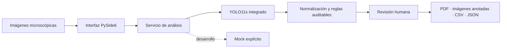

<div align="center">

# VECTOR UroSight

### Análisis trazable de imágenes de sedimento urinario


**[Español](#español)** · **[English](#english)** · [Arquitectura](docs/ARCHITECTURE.md) · [Model Card](docs/MODEL_CARD.md) · [Seguridad](SECURITY.md)

</div>

> [!IMPORTANT]
> VECTOR UroSight es un prototipo académico experimental. **No es un dispositivo médico, no está clínicamente validado y no sustituye la revisión de profesionales del laboratorio.**

---

## Español

### Visión general

VECTOR UroSight es una aplicación de escritorio para apoyar la revisión humana de imágenes microscópicas de sedimento urinario. Detecta elementos visibles, conserva la evidencia de cada predicción, permite corregir resultados y genera reportes auditables en PDF, CSV y JSON.

El diseño sigue una idea central: toda salida automatizada debe ser **revisable, explicable y reversible**.

### Capacidades

| Área | Funcionalidad |
|---|---|
| Interfaz | Flujo minimalista multimagen, temas claro/oscuro, arrastrar y soltar, filtros y revisión visual |
| Inferencia | YOLO11s integrado y ejecutado sin conexión; modo de demostración separado para pruebas |
| Trazabilidad | Clase original y normalizada, confianza, caja, modelo, umbral e imagen fuente |
| Revisión humana | Marcar detecciones correctas, incorrectas, clase equivocada o elementos omitidos |
| Calidad | Alertas técnicas de brillo, contraste y nitidez sin emitir conclusiones clínicas |
| Reportes | PDF clínico, estadísticas, imágenes anotadas y exportaciones CSV/JSON |
| Arquitectura | GUI, dominio, inferencia, reglas, procesamiento y reportes desacoplados |

### Flujo técnico



### Resultados experimentales

El checkpoint final es YOLO11s, ajustado durante 15 épocas sobre el conjunto de entrenamiento canónico y teselas dirigidas de clases minoritarias. La época 13 fue seleccionada exclusivamente con validation. La operación usa inferencia aumentada a 448 px y umbral 0.44 (óptimo de F1 en validation); test permaneció aislado hasta congelar esta configuración.

| Evaluación | Precision | Recall | mAP@50 | mAP@50–95 |
|---|---:|---:|---:|---:|
| Validation USE (448 px, inferencia aumentada) | 0.825059 | 0.815430 | 0.867705 | 0.509357 |
| Test interno USE (448 px, inferencia aumentada) | 0.808721 | 0.813571 | 0.854268 | 0.494546 |
| Evaluación externa UMID | 0.5238 | 0.1199 | 0.0685 | 0.0348 |

La caída en UMID muestra un **cambio de dominio severo**. Estas métricas describen un experimento reproducible; no demuestran desempeño clínico ni generalización a otros laboratorios, microscopios o protocolos.

### Inicio rápido

#### Requisitos

- Python 3.11
- Windows, Linux o macOS
- Entorno virtual recomendado

```bash
python -m venv .venv
```

Active el entorno e instale el modo de demostración:

```bash
python -m pip install -r requirements.txt
python -m src.main
```

#### Modelo YOLO11s sin conexión

Los pesos no se distribuyen en el repositorio. Instale las dependencias opcionales, copie `.env.example` como `.env` y configure una ruta local compatible:

```bash
python -m pip install -r requirements-local.txt
```

```dotenv
INFERENCE_PROVIDER=local
LOCAL_MODEL_PATH=models/vector_urosight/best.pt
CONFIDENCE_THRESHOLD=0.44
```

La inferencia no realiza solicitudes a servicios externos. Una vez instalado y con `best.pt` presente, el programa funciona sin conexión a Internet.

### Pruebas

```bash
python -m pip install -r requirements-dev.txt
python -m pytest -q
```

La versión candidata pasa **43 pruebas automatizadas**. El flujo de integración continua repite la suite en Python 3.11 para cada `push` y `pull request`.

### Datos, privacidad y artefactos

- No se incluyen datasets, imágenes microscópicas, anotaciones, pesos, credenciales ni resultados generados.
- USE y UMID se mencionan únicamente para documentar procedencia experimental; deben obtenerse desde fuentes autorizadas.
- No use información identificable sin autorización institucional, controles de acceso y salvaguardas aplicables.
- La aplicación no es un expediente clínico electrónico ni un LIS.

### Estructura

```text
src/
├── domain/          # Entidades y trazabilidad
├── inference/       # Proveedores desacoplados
├── interpretation/  # Reglas explícitas
├── processing/      # Calidad y normalización
├── reports/         # Generación de reportes
├── services/        # Casos de uso
└── ui/              # Interfaz PySide6

tests/               # Suite automatizada
tools/               # Auditoría, datasets y evaluación
docs/                # Arquitectura, decisiones y evidencia
```

### Documentación

- [Visión del producto](docs/PRODUCT_VISION.md)
- [Arquitectura](docs/ARCHITECTURE.md)
- [Criterios de aceptación](docs/ACCEPTANCE_CRITERIA.md)
- [Model Card](docs/MODEL_CARD.md)
- [Auditoría final de calidad](docs/QUALITY_AUDIT_FINAL.md)
- [Análisis de errores](docs/ERROR_ANALYSIS.md)
- [Avisos de terceros](THIRD_PARTY_NOTICES.md)

### Autoría, desarrollo y licencia

Proyecto de maestría concebido y dirigido por **Ing. José Carlos Malacara Espinosa**, desarrollado con la colaboración y apoyo técnico de **Cómplices Sistemas**, con agradecimiento especial a la **Universidad Tecnológica de Coahuila**.

El proyecto siguió un enfoque de *vibe coding* responsable: desarrollo iterativo asistido por herramientas de IA, con dirección, revisión, pruebas y validación humana.

El código se publica bajo [GNU AGPL-3.0](LICENSE). La integración opcional con Ultralytics requiere conservar las obligaciones de AGPL-3.0 o contar con una licencia comercial aplicable. PySide6/Qt y las demás dependencias mantienen sus propias licencias. Consulte [THIRD_PARTY_NOTICES.md](THIRD_PARTY_NOTICES.md).

---

## English

### Overview

VECTOR UroSight is an academic desktop prototype for human-supervised review of urinary sediment microscopy images. It detects visible elements, preserves prediction provenance, supports manual corrections, and produces auditable PDF, CSV, and JSON reports.

Its core principle is simple: automated output must remain **reviewable, explainable, and reversible**.

### Key features

- Minimal multi-image PySide6 workflow with light/dark themes, visual review, and filtering.
- Fully local YOLO inference; an explicit mock remains only for development and automated tests.
- Traceability for raw/normalized class, confidence, box, model, threshold, and source image.
- Human review for incorrect classes, rejected detections, and omitted elements.
- Explicit rules and technical image-quality warnings.
- Clinical PDF, statistics, annotated images, CSV, and JSON exports.
- Modular architecture with 43 automated tests and GitHub Actions CI.

### Experimental status

| Evaluation | Precision | Recall | mAP@50 | mAP@50–95 |
|---|---:|---:|---:|---:|
| Internal USE validation (448 px, augmented inference) | 0.825059 | 0.815430 | 0.867705 | 0.509357 |
| Internal USE test (448 px, augmented inference) | 0.808721 | 0.813571 | 0.854268 | 0.494546 |
| External UMID evaluation | 0.5238 | 0.1199 | 0.0685 | 0.0348 |

The external result shows severe domain shift. VECTOR UroSight is **not a diagnostic device, is not clinically validated, and must not replace professional laboratory review**.

### Quick start

```bash
python -m venv .venv
python -m pip install -r requirements.txt
python -m src.main
```

Local YOLO setup is described in the Spanish section above. Once dependencies and weights are present, inference requires no network connection. Datasets, model weights, clinical images, and generated artifacts are intentionally excluded.

### License and attribution

Copyright © 2026 José Carlos Malacara Espinosa. Released under [GNU AGPL-3.0](LICENSE). Third-party components remain subject to their respective terms; see [Third-party notices](THIRD_PARTY_NOTICES.md).

---

<div align="center">

**Investigación reproducible · Supervisión humana · Trazabilidad por diseño**

</div>
