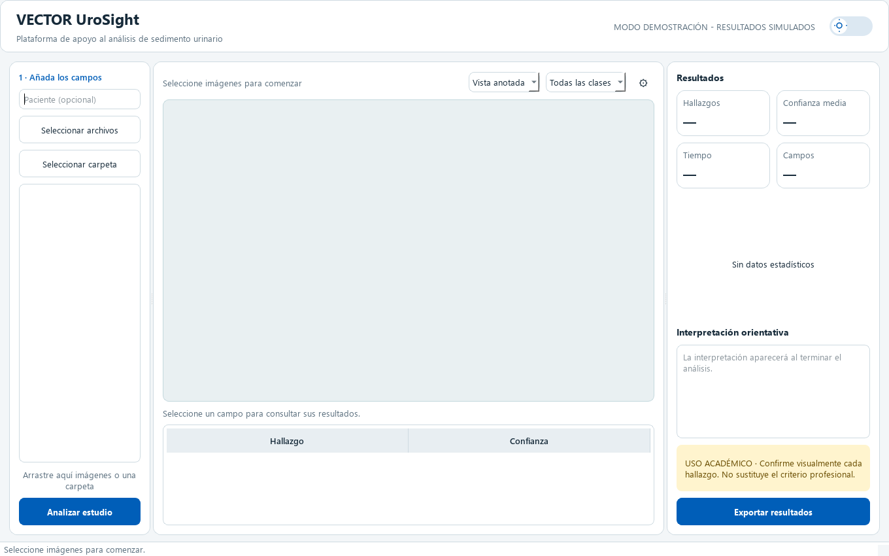
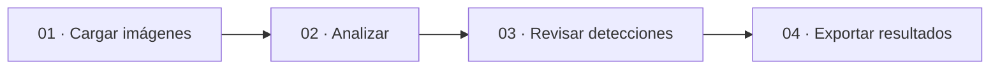

<div align="center">


# VECTOR UroSight

### Microscopía visible. Análisis local. Revisión humana.

[](https://github.com/DnsRudy21/VECTOR_UroSight/actions/workflows/ci.yml)
[](https://www.python.org/)
[](docs/MODEL_CARD.md)
[](LICENSE)

**[Español](README.md) · [English](README.en.md)**

[Modelo y resultados](docs/MODEL_CARD.md) · [Guía de uso](docs/USER_GUIDE.md) · [Desarrollo](CONTRIBUTING.md)

</div>

VECTOR UroSight es una aplicación de escritorio para explorar imágenes de sedimento urinario, revisar detecciones y exportar resultados con su evidencia visual. La inferencia se ejecuta en el equipo del usuario.

> [!IMPORTANT]
> **Prototipo académico experimental.** Requiere revisión profesional y no cuenta con validación clínica. Los conteos corresponden a imágenes, no a valores clínicos calibrados por campo.



<div align="center"><sub>Interfaz del código fuente actual · Modo demostración · Sin datos de pacientes</sub></div>

## De la imagen al reporte



| 🔬 Examinar | ✏️ Revisar | 📄 Compartir |
|:---|:---|:---|
| Una imagen, varias o una carpeta | Clase, confianza y cajas por objeto | Reporte PDF con evidencia |
| Vista original y anotada | Correcciones humanas trazables | Imágenes anotadas y CSV |
| Siete clases de partículas | Avisos de calidad y límite de detecciones | Resultados consolidados por estudio |

**Clases:** eritrocitos · leucocitos · células epiteliales · núcleos epiteliales · cilindros · cristales · levaduras/hongos.

## Agradecimientos

### Cómplice Sistemas C.A. de C.V.

Un reconocimiento especial a **[Cómplice Sistemas C.A. de C.V.](https://www.complise.mx/)** por su colaboración técnica en este proyecto y, de manera destacada, a su director general, **Ing. Alejandro Leal Cueva**.

### Universidad Tecnológica de Coahuila

Agradecemos también a la **Universidad Tecnológica de Coahuila**, como parte del entorno académico en el que se desarrolla este proyecto.

## Resultados y límites

Modelo operativo **YOLO11s**, resolución **448 px** e inferencia aumentada. Se conserva el checkpoint anterior: el último piloto no mejoró la métrica de selección.

| Evaluación | Precisión | Recall | mAP@50 | mAP@50–95 |
|:---|---:|---:|---:|---:|
| Validación interna, reproducida el 08/09/2026 | 0.8251 | 0.8154 | 0.8677 | 0.5094 |
| Test interno, registro histórico | 0.8087 | 0.8136 | 0.8543 | 0.4945 |

Precisión y recall son los del punto de máximo F1 de la evaluación; no representan conteos al umbral fijo de la interfaz. No se volvió a evaluar TEST en el último ciclo.

La evaluación externa histórica en UMID mostró una caída severa (mAP@50–95: **0.0348**). Es un antecedente del proyecto, no una nueva evaluación externa del checkpoint actual. La generalización a otros microscopios o laboratorios sigue pendiente.

La última revisión corrigió etiquetas visibles, exportaciones tras correcciones humanas y avisos de saturación. El Silver Review Pack se utilizó para pruebas sintéticas de funcionamiento; **no se usó para entrenar ni para medir exactitud clínica**.

[Ficha del modelo](docs/MODEL_CARD.md) · [Comparación del último piloto](docs/MODEL_COMPARISON.md) · [Informe experimental](docs/MODEL_IMPROVEMENT_REPORT.md)

## Empezar

### 1. Instalar y abrir la demostración

Requiere **Python 3.11**. Desde la carpeta del proyecto, en PowerShell:

```powershell
python -m venv .venv
.\.venv\Scripts\python.exe -m pip install -r requirements.txt
.\.venv\Scripts\python.exe -m src.main
```

Sin configuración local, la aplicación muestra **resultados simulados**. Este modo permite explorar la interfaz y no necesita pesos.

### 2. Activar inferencia real

Instale las dependencias y prepare la configuración:

```powershell
.\.venv\Scripts\python.exe -m pip install -r requirements-local.txt
Copy-Item .env.example .env
```

Coloque un checkpoint compatible y autorizado en `models/vector_urosight/best.pt`. Edite `.env`:

```dotenv
INFERENCE_PROVIDER=local
LOCAL_MODEL_PATH=models/vector_urosight/best.pt
CONFIDENCE_THRESHOLD=0.443443
LOCAL_MODEL_IMGSZ=448
LOCAL_MODEL_AUGMENT=true
LOCAL_MODEL_MAX_DETECTIONS=300
```

Inicie de nuevo con `.\.venv\Scripts\python.exe -m src.main`. Los pesos no se descargan ni se incluyen en este repositorio. Una vez instaladas las dependencias y el modelo, la inferencia funciona sin Internet.

## Desarrollo y futuro entrenamiento

```powershell
.\.venv\Scripts\python.exe -m pip install -r requirements-dev.txt
.\.venv\Scripts\python.exe -m pytest -q
.\.venv\Scripts\python.exe -m tools.publication_check
```

| Carpeta | Contenido |
|:---|:---|
| `src/` | Aplicación, inferencia, revisión y exportación |
| `tests/` | Pruebas de dominio, interfaz y reportes |
| `tools/` | Auditoría de datos, evaluación y entrenamiento |
| `docs/` | Guía de uso, arquitectura, modelo y experimentos |
| `assets/` | Iconos y vista de la aplicación |
| `scripts/` | Instalación, ejecución y empaquetado |

Los datasets, manifiestos privados, pesos y resultados completos se conservan localmente fuera de Git. Consulte la [guía de reentrenamiento](docs/RETRAINING.md) para reutilizarlos sin contaminar validación o test.

## Autoría y licencia

Proyecto concebido y dirigido por **Ing. José Carlos Malacara Espinosa**.

Código bajo [GNU AGPL-3.0-only](LICENSE). Se conservan las licencias y atribuciones de terceros. La publicación incluye el código fuente; no incluye datasets, imágenes de pacientes, pesos ni ejecutables. Consulte [avisos de terceros](THIRD_PARTY_NOTICES.md) y [seguridad](SECURITY.md).
