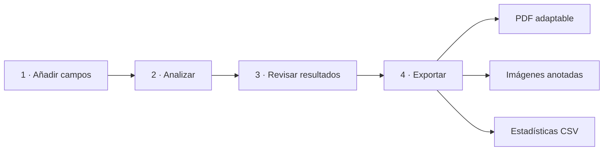

<div align="center">

# VECTOR UroSight

### Visión computacional local y trazable para sedimento urinario

[](https://www.python.org/)
[](docs/MODEL_CARD.md)
[](#inicio-rápido)
[](.github/workflows/ci.yml)
[](LICENSE)
[](#alcance-y-uso-responsable)

**[Español](#español)** · **[English](#english)** · [Modelo](docs/MODEL_CARD.md) · [Arquitectura](docs/ARCHITECTURE.md) · [Seguridad](SECURITY.md)

<sub>Investigación reproducible · Supervisión humana · Privacidad por diseño</sub>

</div>

> [!IMPORTANT]
> **Prototipo académico experimental.** VECTOR UroSight no es un dispositivo médico, no está clínicamente validado y no sustituye la revisión de profesionales del laboratorio.

---

## Español

### Una experiencia simple para un problema complejo

VECTOR UroSight es una aplicación de escritorio que apoya la revisión humana de imágenes microscópicas de sedimento urinario. Todo ocurre localmente: las imágenes no se envían a servicios externos y cada predicción conserva su clase, confianza, caja y procedencia.

El flujo está diseñado para entenderse al verlo:



### Lo esencial

| | Capacidad |
|---|---|
| **Privado** | Inferencia YOLO11s completamente local y utilizable sin Internet |
| **Visual** | Interfaz clínica minimalista, temas claro/oscuro y revisión por campo |
| **Trazable** | Clase, confianza, caja, umbral, modelo e imagen fuente |
| **Auditable** | Revisión humana y controles avanzados disponibles sin saturar la vista |
| **Exportable** | PDF clínico, imágenes anotadas y estadísticas CSV |
| **Adaptable** | El PDF muestra todos los campos: grande para estudios pequeños y hasta 12 evidencias por página en estudios extensos |

### Resultados reales del modelo congelado

**Modelo:** YOLO11s · **checkpoint:** época 13 de 15 · **resolución:** 448 px con inferencia aumentada · **umbral:** 0.443443

| Evaluación | Precision | Recall | mAP@50 | mAP@50-95 |
|---|---:|---:|---:|---:|
| Validation interna | 0.825059 | 0.815430 | 0.867705 | 0.509357 |
| **Test interno independiente** | **0.808721** | **0.813571** | **0.854268** | **0.494546** |
| Evaluación externa UMID | 0.5238 | 0.1199 | 0.0685 | 0.0348 |

> [!WARNING]
> La caída en UMID demuestra un cambio de dominio severo. Los resultados son evidencia experimental reproducible, no evidencia de desempeño clínico ni de generalización entre laboratorios, microscopios o protocolos.

Más detalles y métricas por clase: [Model Card](docs/MODEL_CARD.md).

### Inicio rápido

#### Demostración sin pesos del modelo

```powershell
python -m venv .venv
.\.venv\Scripts\Activate.ps1
python -m pip install -r requirements.txt
python -m src.main
```

#### Inferencia YOLO local

Los pesos no se publican en GitHub. Instale el soporte local y coloque un checkpoint compatible en `models/vector_urosight/best.pt`:

```powershell
python -m pip install -r requirements-local.txt
Copy-Item .env.example .env
python -m src.main
```

Configuración esperada:

```dotenv
INFERENCE_PROVIDER=local
LOCAL_MODEL_PATH=models/vector_urosight/best.pt
CONFIDENCE_THRESHOLD=0.443443
LOCAL_MODEL_IMGSZ=448
LOCAL_MODEL_AUGMENT=true
```

Una vez instaladas las dependencias y presente el checkpoint, la inferencia no necesita conexión a Internet.

### Calidad y pruebas

```powershell
python -m pip install -r requirements-dev.txt
python -m pytest -q
```

La versión 1.0.0 Academic Demo pasa **44 pruebas automatizadas**. La integración continua repite la suite en Python 3.11 para cada `push` y `pull request` a `main`.

### Estructura del repositorio

```text
src/          aplicación, dominio, inferencia, reglas, reportes y UI
tests/        pruebas unitarias, de integración, UI y PDF
tools/        auditoría, preparación de datos y evaluación
docs/         arquitectura, decisiones, modelo y evidencia experimental
assets/       identidad visual de la aplicación
.github/      CI, Dependabot y plantillas de colaboración
```

El repositorio excluye deliberadamente datasets, imágenes clínicas, pesos, ejecutables, reportes generados, secretos y artefactos de entrenamiento.

### Alcance y uso responsable

- No cargue datos identificables de pacientes sin autorización institucional y salvaguardas aplicables.
- Los conteos por imagen no equivalen automáticamente a valores clínicos por campo microscópico.
- Toda salida debe confirmarse visualmente por personal competente.
- La aplicación no es un LIS, expediente clínico electrónico ni dispositivo diagnóstico.

Consulte [Seguridad](SECURITY.md), [Criterios de aceptación](docs/ACCEPTANCE_CRITERIA.md) y [Avisos de terceros](THIRD_PARTY_NOTICES.md).

### Autoría y licencia

Proyecto de maestría concebido y dirigido por **Ing. José Carlos Malacara Espinosa**, desarrollado con colaboración técnica de **Cómplices Sistemas** y agradecimiento a la **Universidad Tecnológica de Coahuila**.

El desarrollo siguió un enfoque de *vibe coding* responsable: iteración asistida por herramientas de IA con dirección, revisión, pruebas y validación humana.

Código publicado bajo [GNU AGPL-3.0](LICENSE). Las dependencias y los datasets conservan sus propias licencias y condiciones. La redistribución de pesos o de un portable requiere una revisión independiente de licencias; no están incluidos en este repositorio.

---

## English

### Overview

VECTOR UroSight is an academic desktop prototype for human-supervised review of urinary sediment microscopy images. It runs YOLO11s locally, preserves prediction provenance, supports visual review, and exports adaptive PDF reports, annotated images, and CSV statistics.

The interface follows one direct workflow: **add fields → analyze → review → export**. Secondary controls remain available without competing with the primary task.

### Highlights

- Fully local inference; images are not sent to external services.
- Minimal clinical UI with light and dark themes.
- Traceability for class, confidence, bounding box, threshold, model, and source image.
- Adaptive PDF evidence gallery that includes every processed field.
- 44 automated tests and GitHub Actions CI.
- Source-only public repository: no datasets, clinical images, credentials, weights, executables, or generated reports.

### Experimental results

| Evaluation | Precision | Recall | mAP@50 | mAP@50-95 |
|---|---:|---:|---:|---:|
| Internal validation | 0.825059 | 0.815430 | 0.867705 | 0.509357 |
| **Independent internal test** | **0.808721** | **0.813571** | **0.854268** | **0.494546** |
| External UMID evaluation | 0.5238 | 0.1199 | 0.0685 | 0.0348 |

The external evaluation reveals severe domain shift. These are reproducible experimental measurements, not clinical validation or proof of generalization.

### Quick start

```powershell
python -m venv .venv
.\.venv\Scripts\Activate.ps1
python -m pip install -r requirements.txt
python -m src.main
```

Local model setup is documented in the Spanish section. Once dependencies and weights are available, inference does not require an Internet connection.

### Responsible use and license

VECTOR UroSight is not a medical device and must not replace professional laboratory review. Do not use identifiable patient data without the required authorization and safeguards.

Copyright © 2026 José Carlos Malacara Espinosa. Released under [GNU AGPL-3.0](LICENSE). See [third-party notices](THIRD_PARTY_NOTICES.md) before redistribution or deployment.

---

<div align="center">

**VECTOR UroSight · Local intelligence, visible evidence, human judgment**

</div>
