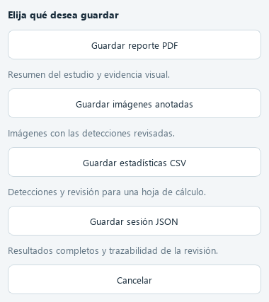

# Guía de uso

## Cargar imágenes

- **Seleccionar archivos:** abre el explorador para elegir una o varias imágenes.
- **Seleccionar carpeta:** carga las imágenes compatibles que están directamente en esa carpeta.
- **Arrastrar y soltar:** admite archivos, carpetas o una selección mixta sobre la ventana, incluida la lista y el visor.

Se admiten JPG, JPEG, PNG, BMP, TIF y TIFF. Las subcarpetas no se recorren automáticamente. Las imágenes repetidas en una misma selección se cargan una sola vez. Una nueva selección sustituye el estudio cargado; guarde sus resultados antes de cambiar de imágenes.

Los archivos incompatibles o dañados se omiten con un aviso. Durante el análisis se bloquea la entrada de otro estudio para evitar mezclar imágenes y resultados.

## Analizar y revisar

Pulse **Analizar estudio** y seleccione cada imagen en la lista para revisar sus detecciones. Los filtros de vista y clase afectan la visualización. El modo demostración identifica expresamente sus resultados como simulados.

Revise las clases, cajas y advertencias. Las correcciones humanas se conservan en el estudio y se reflejan en las exportaciones revisadas. Los conteos corresponden a las imágenes cargadas y requieren interpretación profesional.

## Exportar

Pulse **Exportar resultados**. Una ventana muestra cuatro acciones independientes:

| Acción | Resultado |
|:---|:---|
| Guardar reporte PDF | Resumen del estudio y evidencia visual |
| Guardar imágenes anotadas | Imágenes con detecciones revisadas |
| Guardar estadísticas CSV | Detecciones, clases efectivas y estados de revisión |
| Guardar sesión JSON | Resultados completos y trazabilidad |

Cada acción solicita dónde guardar. **Cancelar** cierra la ventana sin exportar. El botón se habilita cuando hay un estudio analizado.

## Privacidad

El nombre del paciente es opcional. Las exportaciones pueden contener los datos introducidos; revise su contenido antes de compartirlas. El procesamiento de imágenes es local.

## Distribución portable

Modelo y umbral están congelados. Si faltan pesos o no coincide su checksum, restaure la distribución completa. No hay descarga automática ni sustitución por un modelo simulado. En campos densos se muestran cajas; seleccione una fila para consultar la etiqueta y confianza. Las exportaciones conservan el estado revisado y la procedencia original. La cancelación finaliza el campo en curso y permite exportar resultados parciales.
